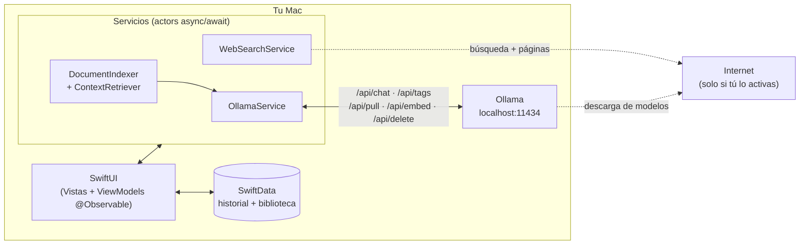

# local-llm-studio

**Tu estudio privado de IA, 100% en tu Mac.**

Aplicación nativa de macOS (SwiftUI) para gestionar y conversar con modelos de lenguaje locales —Llama, DeepSeek, Mistral, Gemma, Qwen, Phi, LLaVA…— a través de [Ollama](https://ollama.com), con biblioteca de documentos propia para RAG privado y búsqueda web híbrida opcional.


---

## ¿Por qué?

Los asistentes de IA en la nube obligan a elegir entre capacidad y privacidad. **local-llm-studio** elimina ese dilema: toda la inferencia ocurre en tu Mac, tus conversaciones y documentos nunca salen de él, y aun así puedes darle al modelo acceso puntual a internet cuando tú lo decidas.

- **Privacidad por diseño**: el chat, el historial y la biblioteca de documentos se procesan y almacenan localmente. Sin cuentas, sin telemetría, sin APIs de pago.
- **Todo desde la interfaz**: descarga y elimina modelos, indexa documentos y conversa sin tocar la terminal ni una sola vez.
- **Cero dependencias externas**: solo frameworks de Apple (SwiftUI, SwiftData, PDFKit, Foundation). El proyecto compila tal cual, sin resolver paquetes de terceros.

## Características

### Chat con modelos locales
- Respuestas en **streaming token a token**, con cancelación instantánea que conserva el texto parcial.
- Selector de modelo en la barra superior; cambia de modelo en mitad de una conversación.
- **Chat multimodal**: adjunta imágenes PNG/JPEG y pregunta sobre ellas con modelos de visión como LLaVA.
- Historial **persistente con SwiftData**: renombra conversaciones y busca en todo el historial por título o contenido.

### Gestión de modelos sin terminal
- **Catálogo integrado** con una selección curada de los modelos más relevantes del ecosistema, con descripción en español, fabricante y tamaño de descarga.
- Descarga con un clic, **progreso en vivo**, descargas concurrentes y cancelables (lo ya bajado se conserva).
- Elimina modelos instalados desde la propia app para liberar disco, con confirmación del espacio recuperado.
- Si Ollama no está en ejecución, **la app lo arranca sola** en segundo plano.

### Biblioteca de documentos (RAG privado)
- Añade Markdown, TXT o PDF; la app guarda una referencia (nunca copia el archivo) y lo indexa en tu Mac.
- **Búsqueda semántica con embeddings locales** (`nomic-embed-text`, que la app instala automáticamente en el primer arranque), con respaldo por palabras clave si aún no está disponible.
- Fragmentación inteligente que respeta párrafos con solapamiento entre fragmentos.
- El contexto relevante se inyecta en el prompt **citando el documento de origen**, y puede activarse o desactivarse por conversación.

### Búsqueda web híbrida (opcional)
- **Desactivada por defecto**: un interruptor de privacidad controla si el asistente puede consultar internet, y la elección se recuerda.
- Sin claves de API ni cuentas: búsqueda vía DuckDuckGo y **lectura del contenido completo** de las páginas principales, limpiado de forma nativa.
- El modelo local responde citando las fuentes con su URL, y cada respuesta que usó internet queda **marcada visiblemente** en el chat (también en el historial).

### Experiencia de producto
- **Markdown enriquecido** en las respuestas: bloques de código con etiqueta de lenguaje y botón de copiar, también durante el streaming.
- **Ventana de Ajustes nativa (⌘,)**: host y puerto de Ollama, instrucciones de sistema, temperatura y ventana de contexto.
- **Métricas de generación** bajo cada respuesta: modelo, tokens por segundo y duración.
- **Exporta cualquier conversación a Markdown** desde el menú contextual del historial.
- **Arrastra y suelta** sobre el chat: imágenes para el mensaje, documentos para la biblioteca RAG.
- **Onboarding de primer arranque**: si Ollama no está instalado, una guía visual de tres pasos sustituye al mensaje de error.

## Arquitectura



| Capa | Tecnología | Papel |
|---|---|---|
| Interfaz | SwiftUI + `@Observable` | Tres zonas: historial, chat y gestión de modelos. Estados de carga fluidos. |
| Concurrencia | `async/await`, `actor`, `AsyncThrowingStream` | Streaming sin bloquear la UI; servicios seguros frente a concurrencia. |
| Persistencia | SwiftData (+ `.externalStorage` para imágenes) | Conversaciones, documentos, fragmentos y embeddings. |
| Inferencia | Ollama (API REST local) | Chat, embeddings y gestión de modelos en `localhost:11434`. |
| Documentos | PDFKit + Foundation | Extracción de texto nativa, sin librerías de terceros. |

### Privacidad: qué sale de tu Mac y cuándo

| Acción | ¿Red? | Destino |
|---|---|---|
| Chatear, indexar documentos, buscar en el historial | No | Todo local |
| Descargar un modelo del catálogo | Sí (una vez) | Registro de Ollama |
| Búsqueda web del asistente | Solo con el interruptor activado | DuckDuckGo + páginas de resultados |

## Empezar

### Requisitos

- macOS 14.0 o superior (Apple Silicon o Intel).
- Xcode 16 o superior.
- [Ollama](https://ollama.com/download) instalado (descarga única; después todo funciona offline).

### Compilar y ejecutar

```bash
git clone https://github.com/juanmmm21/local-llm-studio.git
cd local-llm-studio
xcodebuild -scheme local-llm-studio -destination 'platform=macOS' build
```

O simplemente abre `local-llm-studio.xcodeproj` en Xcode y pulsa ⌘R. En el primer arranque, la app iniciará Ollama si hace falta, te ofrecerá el catálogo si no tienes modelos y preparará el índice semántico por su cuenta.

### Atajos de teclado

| Atajo | Acción |
|---|---|
| ⌘↩ | Enviar mensaje |
| ⇧⌘N | Nueva conversación |
| ⇧⌘D | Catálogo de modelos |
| ⇧⌘L | Biblioteca de documentos |
| ⌘R | Recargar modelos locales |

## Estructura del proyecto

```
local-llm-studio/
├── App/            # Punto de entrada, contenedor SwiftData y escena de Ajustes
├── Models/         # Dominio, ajustes y contratos JSON de la API local de Ollama
├── Services/       # OllamaService, indexado RAG, búsqueda web, exportación
├── ViewModels/     # Estado observable (@Observable, MainActor)
├── Views/          # Vistas SwiftUI (chat, catálogo, biblioteca, onboarding, ajustes)
└── Resources/      # Assets (icono propio) y entitlements (App Sandbox)
```

## Hoja de ruta

- [x] **Fase 1** — Conectividad local: chat en streaming, UI de tres zonas, auto-arranque de Ollama.
- [x] **Fase 2** — Catálogo de modelos con descarga integrada y progreso en vivo.
- [x] **Fase 3** — Persistencia con SwiftData y biblioteca RAG con embeddings locales.
- [x] **Fase 4** — Búsqueda web híbrida con interruptor de privacidad e indicador de fuente.
- [x] **Fase 5** — Gestión de modelos instalados, índice semántico auto-instalado, renombrado y búsqueda del historial, lectura completa de páginas y chat con imágenes.
- [x] **Fase 6** — Experiencia de producto: Markdown enriquecido, Ajustes nativos, métricas, exportación, arrastrar y soltar, onboarding e icono propio.
- [ ] Próximamente: más mejoras en la hoja de ruta (ver issues).

## Licencia

Publicado bajo la [licencia MIT](LICENSE).

## Autor

Desarrollado por **[juanmmm21](https://github.com/juanmmm21)**. El proyecto sigue una filosofía *local-first*: la capacidad de la IA moderna con la privacidad de lo que nunca sale de tu máquina.
