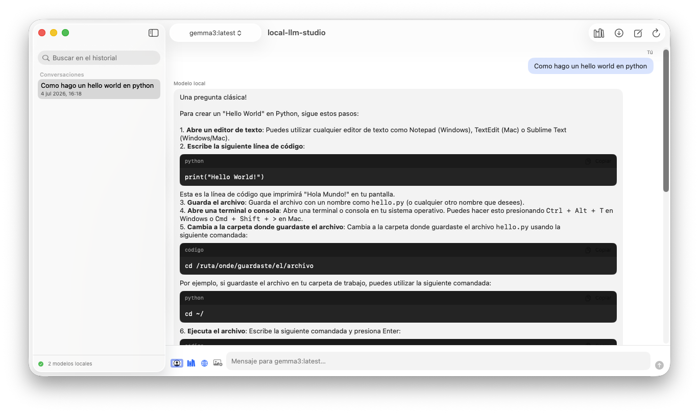
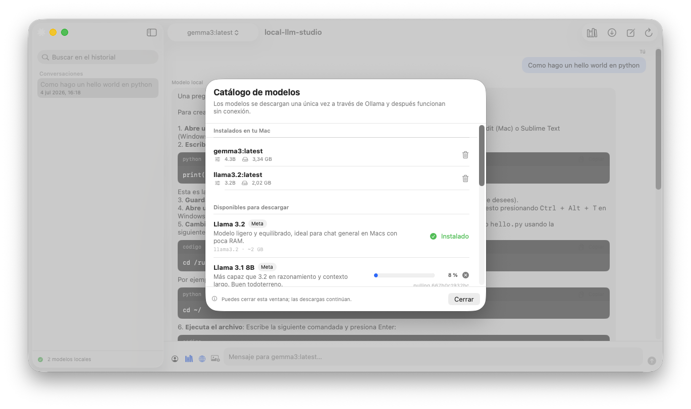
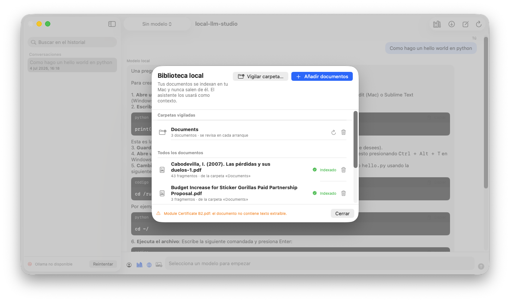
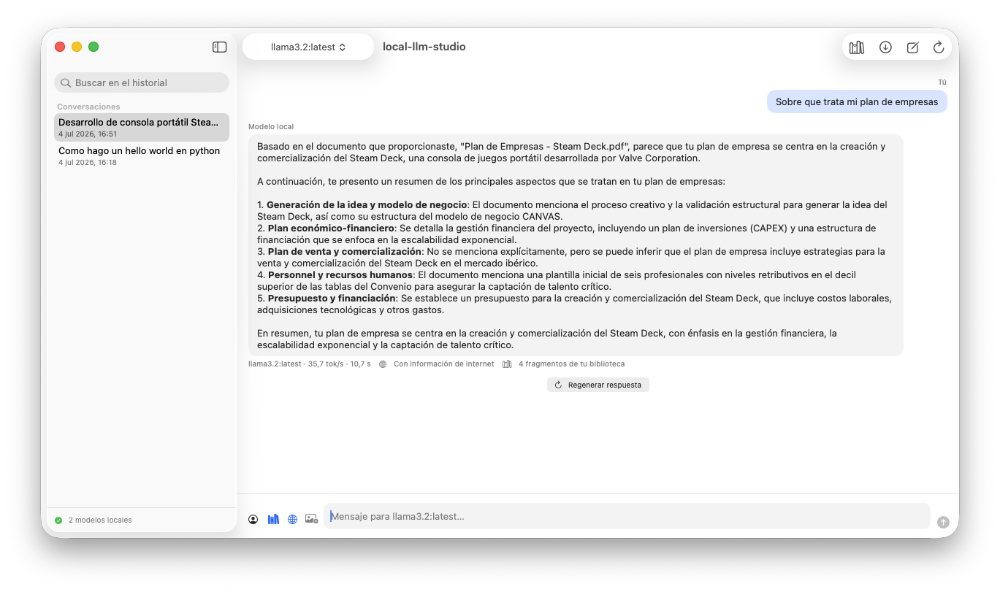
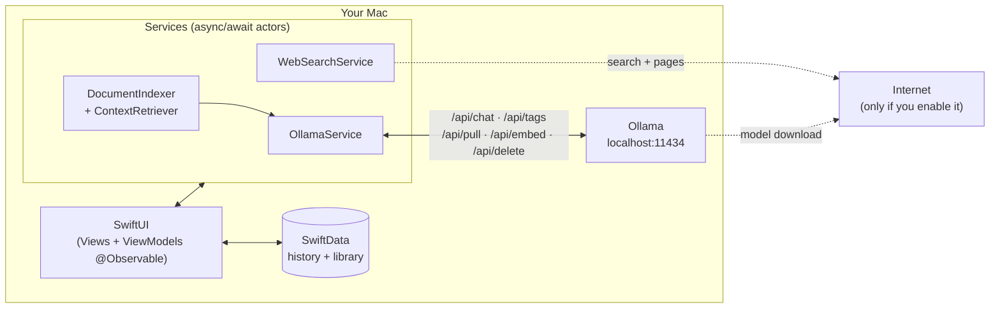

# local-llm-studio

**Your private AI studio, 100% on your Mac.**

Native macOS app (SwiftUI) to manage and chat with local language models —Llama, DeepSeek, Mistral, Gemma, Qwen, Phi, LLaVA…— through [Ollama](https://ollama.com), with its own document library for private RAG and optional hybrid web search.

[](https://github.com/juanmmm21/local-llm-studio/actions/workflows/ci.yml)


---

## Screenshots

**Chat with local models**, with streaming responses, rich Markdown and copyable code blocks:



| Built-in model catalog | Private RAG library |
|---|---|
|  |  |

**Verifiable sources**: every response that used your library shows the exact fragments that were injected as context:



## Why?

Cloud AI assistants force you to choose between capability and privacy. **local-llm-studio** removes that dilemma: all inference happens on your Mac, your conversations and documents never leave it, and you can still give the model on-demand internet access whenever you decide to.

- **Privacy by design**: chat, history, and the document library are processed and stored locally. No accounts, no telemetry, no paid APIs.
- **Everything from the interface**: download and remove models, index documents, and chat without ever touching the terminal.
- **Zero external dependencies**: only Apple frameworks (SwiftUI, SwiftData, PDFKit, Foundation). The project builds as-is, with no third-party packages to resolve.

## Features

### Chat with local models
- **Token-by-token streaming** responses, with instant cancellation that keeps the partial text.
- Model selector in the top bar; switch models mid-conversation.
- **Regenerate the last response** with one click (even with a different model) and **edit and resend** any of your messages: the conversation continues from that point.
- **Per-conversation assistant templates** (translator, code reviewer, writer, teacher, summarizer), each with its own system instructions.
- **Automatic titles**: the local model itself summarizes the conversation into a title after the first exchange.
- **Multimodal chat**: attach PNG/JPEG images and ask about them with vision models like LLaVA.
- **Persistent history with SwiftData**: rename conversations and search the whole history by title or content.
- **Quick question from the macOS menu bar**: a one-off query without opening the main window and without saving history.

### Model management without a terminal
- **Built-in catalog** with a curated selection of the most relevant models in the ecosystem, with a description in Spanish, vendor, and download size.
- One-click download, **live progress**, concurrent and cancelable downloads (what's already downloaded is kept).
- Remove installed models from within the app to free up disk space, with confirmation of the space recovered.
- **Memory indicator**: see which models are currently loaded into RAM and how much they occupy, and **evict them from memory** without deleting them from disk.
- If Ollama isn't running, **the app starts it on its own** in the background; and if it isn't installed, a **guided onboarding** walks you through the first launch.

### Document library (private RAG)
- Add Markdown, TXT, or PDF; the app stores a reference (never copies the file) and indexes it on your Mac.
- **Watched folders**: pick a folder and the library syncs itself on every launch —new documents get indexed and deleted ones disappear.
- **Semantic search with local embeddings** (`nomic-embed-text`, which the app installs automatically on first launch), with keyword-based fallback if it isn't available yet.
- Smart chunking that respects paragraphs with overlap between fragments.
- Relevant context is injected into the prompt **citing the source document**, and can be toggled on or off per conversation.
- **Verifiable sources**: every response that used the library shows, in an expandable view, the exact fragments that were injected as context.

### Hybrid web search (optional)
- **Disabled by default**: a privacy toggle controls whether the assistant can query the internet, and the choice is remembered.
- No API keys or accounts: search via DuckDuckGo and **full-text reading** of the top pages, cleaned up natively.
- The local model answers citing sources with their URL, and every response that used the internet is **clearly marked** in the chat (also in the history).

### Product experience
- **Rich Markdown** in responses: code blocks with a language tag and a copy button, even during streaming.
- **Native Settings window (⌘,)**: Ollama host and port, system instructions, temperature, and context window.
- **Generation metrics** under each response: model, tokens per second, and duration.
- **Export any conversation to Markdown** from the history's context menu.
- **Drag and drop** onto the chat: images for the message, documents for the RAG library.
- **First-launch onboarding**: if Ollama isn't installed, a three-step visual guide replaces the error message.

## Architecture



| Layer | Technology | Role |
|---|---|---|
| Interface | SwiftUI + `@Observable` | Three zones: history, chat, and model management. Smooth loading states. |
| Quality | XCTest | Unit test suite for Markdown parsing, RAG retrieval, chunking, and web parsing. |
| Concurrency | `async/await`, `actor`, `AsyncThrowingStream` | Streaming without blocking the UI; concurrency-safe services. |
| Persistence | SwiftData (+ `.externalStorage` for images) | Conversations, documents, fragments, and embeddings. |
| Inference | Ollama (local REST API) | Chat, embeddings, and model management on `localhost:11434`. |
| Documents | PDFKit + Foundation | Native text extraction, no third-party libraries. |

### Privacy: what leaves your Mac and when

| Action | Network? | Destination |
|---|---|---|
| Chatting, indexing documents, searching history | No | Everything local |
| Downloading a model from the catalog | Yes (once) | Ollama registry |
| Assistant web search | Only with the toggle enabled | DuckDuckGo + result pages |

## Getting started

### Direct download

You can download the packaged app from the [releases page](https://github.com/juanmmm21/local-llm-studio/releases): mount the DMG and drag the app to Applications.

> **Gatekeeper note**: the app is signed locally (without Apple notarization, which requires a paid developer account). The first time, open it with right-click → "Open" and confirm. If you'd rather not trust binaries, build it yourself in a minute (below).

### Requirements

- macOS 14.0 or later (Apple Silicon or Intel).
- Xcode 16 or later.
- [Ollama](https://ollama.com/download) installed (one-time download; everything works offline afterward).

### Build and run

```bash
git clone https://github.com/juanmmm21/local-llm-studio.git
cd local-llm-studio
xcodebuild -scheme local-llm-studio -destination 'platform=macOS' build

# Run the test suite
xcodebuild -scheme local-llm-studio -destination 'platform=macOS' test
```

Or simply open `local-llm-studio.xcodeproj` in Xcode and press ⌘R. On first launch, the app will start Ollama if needed, offer you the catalog if you have no models, and prepare the semantic index on its own.

### Keyboard shortcuts

| Shortcut | Action |
|---|---|
| ⌘↩ | Send message |
| ⇧⌘N | New conversation |
| ⇧⌘D | Model catalog |
| ⇧⌘L | Document library |
| ⌘R | Reload local models |

## Project structure

```
local-llm-studio/
├── App/            # Entry point, SwiftData container, Settings, and menu bar
├── Models/         # Domain, settings, and JSON contracts for the local Ollama API
├── Services/       # OllamaService, RAG indexing, web search, export
├── ViewModels/     # Observable state (@Observable, MainActor)
├── Views/          # SwiftUI views (chat, catalog, library, onboarding, settings)
└── Resources/      # Assets (custom icon) and entitlements (App Sandbox)
local-llm-studioTests/  # Unit tests (XCTest)
```

## Roadmap

- [x] **Phase 1** — Local connectivity: streaming chat, three-zone UI, Ollama auto-start.
- [x] **Phase 2** — Model catalog with built-in download and live progress.
- [x] **Phase 3** — Persistence with SwiftData and RAG library with local embeddings.
- [x] **Phase 4** — Hybrid web search with a privacy toggle and source indicator.
- [x] **Phase 5** — Management of installed models, auto-installed semantic index, history renaming and search, full page reading, and chat with images.
- [x] **Phase 6** — Product experience: rich Markdown, native Settings, metrics, export, drag and drop, onboarding, and custom icon.
- [x] **Phase 7** — Regenerate/edit messages, assistant templates, automatic titles, visible RAG sources, watched folders, memory indicator, menu bar, and test suite.
- [x] **Phase 8** — Showcase and distribution: screenshots, redesigned icon, CI with GitHub Actions, and releases with downloadable DMG.

## License

Released under the [MIT license](LICENSE).

## Author

Developed by **[juanmmm21](https://github.com/juanmmm21)**. The project follows a *local-first* philosophy: the power of modern AI with the privacy of something that never leaves your machine.
